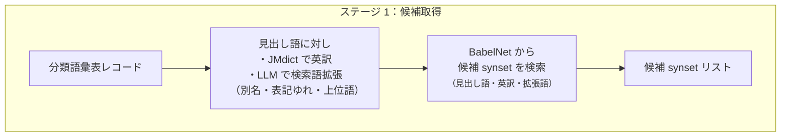
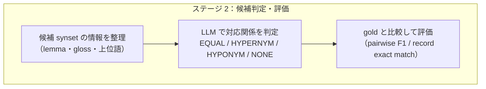

# LLM による分類語彙表と BabelNet の語義アラインメント

このリポジトリは、日本語辞書である分類語彙表と、多言語辞書である BabelNet の対応付けを行う研究の公開版です。
公開版では、実験コード・設定・結果要約を通して、研究の構造と実装上の工夫を追えるように整理しています。

<p align="left">
  
  
  
  
  
</p>

> **English summary** — This repository accompanies the paper [_Sense Alignment between WLSP and BabelNet using LLMs_](https://www.anlp.jp/proceedings/annual_meeting/2026/pdf_dir/Q2-10.pdf "NLP2026 Q2-10") (NLP 2026). The project builds a two-stage pipeline that aligns entries in the Word List by Semantic Principles (WLSP), a Japanese thesaurus, with synsets in BabelNet, a multilingual lexical network. Stage 1 retrieves candidate synsets via LLM-based term expansion and BabelNet search; Stage 2 filters them with an LLM that assigns 4-way labels (EQUAL / HYPERNYM / HYPONYM / NONE). The best LLM configuration achieves pairwise F1 = **0.83**, outperforming the best non-LLM baseline (F1 = 0.68) by **15 points**. Gold annotation datasets were constructed in collaboration with the National Institute for Japanese Language and Linguistics (NINJAL).

---

## 研究概要

本研究の目的は、日本語辞書である**分類語彙表**と、多言語語彙ネットワークである**BabelNet**の対応付けを行うことです。

対応付けが実現すると、分類語彙表に BabelNet の語彙間関係を移植でき、日本語 NLP の意味処理基盤の強化につながります。

提案手法は**①候補絞り込み → ②対応判定**の2段階の[パイプライン](#パイプライン)になっています。これは、両辞書とも巨大であるため、先に対応し得る候補を取り出す必要があるためです。

**国立国語研究所**と連携し、正解アノテーションデータの整備も進めています。

論文: [NLP2026 Q2-10 — LLM による分類語彙表と BabelNet の語義アラインメント](https://www.anlp.jp/proceedings/annual_meeting/2026/pdf_dir/Q2-10.pdf "NLP2026 Q2-10 LLMによる分類語彙表とBabelNetの語義アラインメント")（実験設定が掲載時から変化していますのでご注意ください）

---

## パイプライン

### ステージ 1 — 候補取得



### ステージ 2 — 候補判定・評価



---

## 評価結果

主指標は、分類語彙表レコードと候補 synset のペアについて `EQUAL`（同義）を正しく判定できるかを見る **pairwise F1** です。

### LLM アラインメント

| 評価データ | モデル               | n_records | n_pairs | Precision | Recall |         F1 |
| ---------- | -------------------- | --------: | ------: | --------: | -----: | ---------: |
| Gold B     | `gpt-5.2-2025-12-11` |       177 |   2,654 |    0.8706 | 0.8000 | **0.8338** |
| Gold B     | `gpt-5.4-2026-03-05` |       177 |   2,654 |    0.8896 | 0.7838 |     0.8333 |
| Gold A     | `gpt-5.2-2025-12-11` |        86 |   1,003 |    0.8571 | 0.7714 | **0.8120** |
| Gold A     | `gpt-5.4-2026-03-05` |        86 |   1,003 |    0.7971 | 0.7857 |     0.7914 |

<small>推論量は両モデルとも high。詳細は <a href="docs/alignment/README.md">docs/alignment/README.md</a> を参照。</small>

### ベースライン（非 API 手法）

ベースラインでは Gold B を開発用データとして手法・設定を選択し、Gold A への転移評価で汎化性能を確認しました。

| 評価データ | 手法               | 設定                                    | Precision | Recall |         F1 |
| ---------- | ------------------ | --------------------------------------- | --------: | -----: | ---------: |
| Gold B     | Pairwise lexical   | LogisticRegression                      |    0.5169 | 0.5784 |     0.5459 |
| Gold B     | E5 ranking         | `intfloat/multilingual-e5-large`, top-1 |    0.6723 | 0.6432 |     0.6575 |
| Gold B     | BGE reranker       | `BAAI/bge-reranker-v2-m3`, top-1        |    0.5989 | 0.5730 |     0.5856 |
| Gold B     | Hybrid best        | lexical + E5 ranking                    |    0.6211 | 0.7622 | **0.6845** |
| Gold A     | Gold B hybrid 転移 | Gold B で学習したモデルをそのまま適用   |    0.4237 | 0.7143 |     0.5319 |
| Gold A     | BGE reranker       | `BAAI/bge-reranker-v2-m3`, top-1        |    0.5000 | 0.6143 |     0.5513 |

<small>詳細は <a href="docs/baselines/README.md">docs/baselines/README.md</a> を参照。</small>

LLM アラインメント（F1 = 0.83）はベースライン最高値（F1 = 0.68）を 15 ポイント上回りました。

Gold B で選んだ Hybrid best を Gold A に転移させると F1 = 0.53 に低下することから、Gold A と Gold B は特性が異なり、レコード単位で質が異なるアラインメントタスクであることが確認できました。

---

## 研究で行ったこと

| 取り組み | 概要 |
|---|---|
| 2 段階パイプラインの設計・実装 | 候補取得（term expansion → BabelNet 検索）と候補判定（LLM）を分離した構成を設計・実装 |
| 4 種のベースライン実装と比較分析 | Pairwise lexical・E5 ranking・BGE reranker・Hybrid を実装。Gold B で設定選択し Gold A への転移評価まで一貫して実施 |
| LLM プロンプト設計と出力スキーマの定義 | 4 値分類（`EQUAL / HYPERNYM / HYPONYM / NONE`）の few-shot プロンプトを設計。JSON Schema で構造化出力を強制し入出力の整合性を検証 |
| 多角的な評価設計 | pairwise F1 と record exact match を組み合わせ、ペア単位・レコード単位の両面から誤り傾向を分析（詳細は[卒業論文](https://drive.google.com/file/d/1ReCxskEOtIV67eivSDymeZBjhWBMT48v/view?usp=sharing/)参照） |
| 正解データの整備 | 国立国語研究所と連携し、Gold A・Gold B のアノテーション整備に参加 |

---

## 技術スタック

| カテゴリ           | 内容                                                                                                    |
| ------------------ | ------------------------------------------------------------------------------------------------------- |
| 言語               | Python 3.8+                                                                                             |
| データ処理         | pandas, NumPy                                                                                           |
| データ形式         | pickle, parquet, JSON, CSV                                                                              |
| ベースライン       | scikit-learn, PyTorch                                                                                   |
| 埋め込み・reranker | multilingual E5, MPNet, BGE reranker                                                                    |
| LLM API            | OpenAI Responses API                                                                                    |
| BabelNet 連携      | babelnet, zerorpc, Docker                                                                               |
| 実験環境管理       | [requirements.txt](requirements.txt) / [requirements-babelnet-py38.txt](requirements-babelnet-py38.txt) |

BabelNet 関連の処理は Python 3.8 / `.venv38` 環境に分離しています（後述）。

---

## ディレクトリ構成

```
.
├── src/
│   ├── alignment/          # LLM アラインメント実験
│   ├── baselines/          # 非 API ベースライン
│   ├── term_expansion/     # 候補検索語の生成拡張
│   └── babelnet_pipeline/  # BabelNet 候補取得パイプライン
├── docs/
│   ├── alignment/          # LLM アラインメントの説明（プロンプト・スキーマ含む）
│   ├── baselines/          # ベースラインの説明・結果・実験ログ
│   └── term_expansion/     # 候補語拡張の説明
├── data/
│   ├── gold/               # 正解データ（Gold A / Gold B）
│   ├── interim/            # API 入力用の中間生成物
│   └── processed/          # BabelNet 前処理済みデータ（非公開）
└── outputs/
    ├── baselines/          # ベースライン設定・評価要約
    └── api_runs/           # term expansion の公開 parsed 出力
```

各ディレクトリの詳細:

- [src/alignment/](src/alignment/) — API アラインメント実験スクリプト
- [src/baselines/](src/baselines/) — 非 API ベースライン
- [src/term_expansion/](src/term_expansion/) — 候補検索語の生成拡張
- [docs/baselines/](docs/baselines/) — ベースラインの説明・結果・実験ログ
- [docs/alignment/](docs/alignment/) — LLM アラインメントの説明
- [docs/term_expansion/](docs/term_expansion/) — 候補語拡張の説明
- [outputs/baselines/](outputs/baselines/) — 公開してよい軽量な設定・要約のみ
- [outputs/api_runs/term_expansion/version_1/gold_A/parsed/](outputs/api_runs/term_expansion/version_1/gold_A/parsed/) — Gold A term expansion 公開 parsed 出力
- [outputs/api_runs/term_expansion/version_1/gold_B/parsed/](outputs/api_runs/term_expansion/version_1/gold_B/parsed/) — Gold B term expansion 公開 parsed 出力

---

## 実行方法

各スクリプトは現在の実験設定をデフォルト値として持ち、引数なしでも動作します。主要な入出力は CLI 引数で上書きできます。

実行例は PowerShell を想定しています（バッククォート `` ` `` で改行）。

### 環境セットアップ

```powershell
# 通常の実験・評価用
py -m venv .venv
.\.venv\Scripts\Activate.ps1
python -m pip install -r requirements.txt
$env:PYTHONPATH = "src"

# BabelNet 関連処理のみ Python 3.8 の仮想環境を使う
py -3.8 -m venv .venv38
.\.venv38\Scripts\python.exe -m pip install -r requirements-babelnet-py38.txt
```

OpenAI API を使う処理では `.vscode/openai-key.json` に API キー設定が必要です。  
BabelNet を使う処理では、BabelNet 本体のディレクトリを `BABELNET_DIR` に指定してください。

### ステージ 1：候補取得

```powershell
# 1. 候補語拡張用の LLM 入力を作成
python src/term_expansion/term_expansion_inputs.py `
  --wlsp data/processed/wlsp.pkl `
  --records data/gold/gold_A_records.pkl `
  --out-dir data/interim/api_inputs/term_expansion/version_1/gold_A

# 2. LLM で候補検索語を拡張
python src/term_expansion/run_term_expansion.py `
  --model gpt-5.2 `
  --input-dir data/interim/api_inputs/term_expansion/version_1/gold_A `
  --out-dir outputs/api_runs/term_expansion/version_1/gold_A `
  --key_path .vscode/openai-key.json `
  --batch_size 20

# 3. BabelNet から候補 synset を取得
$env:BABELNET_DIR = "Path-to-BabelNet"

python src/babelnet_pipeline/run_babelnet_pipeline.py `
  --records-pkl data/gold/gold_A_records.pkl `
  --babelnet-pkl data/processed/babelnet_.pkl `
  --term-outputs-dir outputs/api_runs/term_expansion/version_1/gold_A `
  --babelnet-dir $env:BABELNET_DIR `
  --max-workers 4
```

### ステージ 2a：ベースライン + 評価

```powershell
# 1. Gold B で文字列・語彙特徴ベースの分類器を評価
python src/baselines/run_gold_b_baseline.py `
  --records data/gold/gold_B_records.pkl `
  --gold data/gold/gold_B.pkl `
  --babelnet data/processed/babelnet_.pkl `
  --output-dir outputs/baselines/gold_B

# 2. Gold B で埋め込みランキングを評価
python src/baselines/run_gold_b_ranking.py `
  --model intfloat/multilingual-e5-large `
  --records data/gold/gold_B_records.pkl `
  --gold data/gold/gold_B.pkl `
  --babelnet data/processed/babelnet_.pkl `
  --output-dir outputs/baselines/gold_B_ranking

# 3. Gold B で BGE reranker を評価
python src/baselines/run_gold_b_cross_encoder.py `
  --model BAAI/bge-reranker-v2-m3 `
  --records data/gold/gold_B_records.pkl `
  --gold data/gold/gold_B.pkl `
  --babelnet data/processed/babelnet_.pkl `
  --output-dir outputs/baselines/gold_B_cross_encoder

# 4. Gold B で hybrid の重みを探索・評価
python src/baselines/run_gold_b_hybrid_search.py `
  --pair-features outputs/baselines/gold_B/pair_features.pkl `
  --rankings outputs/baselines/gold_B_ranking/rankings.pkl `
  --output-dir outputs/baselines/gold_B_hybrid_search `
  --best-output-dir outputs/baselines/gold_B_hybrid_best

# 5. Gold B の record 単位評価を作成
python src/baselines/run_gold_b_record_decoder.py `
  --hybrid-features outputs/baselines/gold_B_hybrid_best/pair_features_hybrid.pkl `
  --output-dir outputs/baselines/gold_B_record_decoder

# 6. Gold B で決めた best hybrid を Gold A に転移・評価
python src/baselines/run_gold_a_hybrid_best.py `
  --config outputs/baselines/gold_B_hybrid_best/config.json `
  --model-bundle outputs/baselines/gold_B_hybrid_best/logreg_model.pkl `
  --records data/gold/gold_A_records.pkl `
  --gold data/gold/gold_A.pkl `
  --babelnet data/processed/babelnet_.pkl `
  --output-dir outputs/baselines/gold_A_hybrid_best `
  --e5-model intfloat/multilingual-e5-large

# 7. Gold A で学習なし手法を評価
python src/baselines/run_gold_a_no_training_methods.py `
  --records data/gold/gold_A_records.pkl `
  --gold data/gold/gold_A.pkl `
  --babelnet data/processed/babelnet_.pkl `
  --output-dir outputs/baselines/gold_A_no_training_methods `
  --e5-model intfloat/multilingual-e5-large `
  --cross-model BAAI/bge-reranker-v2-m3
```

### ステージ 2b：LLM アラインメント + 評価

```powershell
# 1. LLM アラインメント用の入力を作成
python src/alignment/alignment_inputs.py `
  --records data/gold/gold_A_records.pkl `
  --babelnet data/processed/babelnet_.pkl `
  --out-dir data/interim/api_inputs/alignment/version_1/gold_A

# 2. LLM で対応関係を判定
python src/alignment/run_alignment.py `
  --model gpt-5.4-2026-03-05 `
  --input-dir data/interim/api_inputs/alignment/version_1/gold_A `
  --out-dir outputs/api_runs/alignment/gpt-5.4-2026-03-05_high_v1_v1/gold_A `
  --key-path .vscode/openai-key.json

# 3. LLM アラインメント結果を評価
python src/alignment/evaluate_alignment.py `
  --gold data/gold/gold_A.pkl `
  --pred-dir outputs/api_runs/alignment/gpt-5.4-2026-03-05_high_v1_v1/gold_A/parsed `
  --out-dir outputs/api_runs/alignment/gpt-5.4-2026-03-05_high_v1_v1/gold_A/evaluation
```

---

## 再現できる範囲

公開版では次のレベルの再現を想定しています。

- 実験設計の理解
- ベースライン実装の読解
- 実験設定と主要結果の確認
- 各スクリプトの入出力関係の確認

一方で、次の内容はそのままでは再実行できません。

- BabelNet データ本体を必要とする処理
- BabelNet 由来の中間生成物をそのまま使う再実行
- API の生出力を含む完全な再実行

公開版では、研究の構造・設計判断・実装の流れを追えることを重視しています。ライセンスや公開方針の制約があるデータ本体は含めていません。

---

## 詳細ドキュメント

| ドキュメント                                                   | 内容                                                 |
| -------------------------------------------------------------- | ---------------------------------------------------- |
| [docs/alignment/README.md](docs/alignment/README.md)           | LLM アラインメントの全体像・評価結果・プロンプト設計 |
| [docs/baselines/README.md](docs/baselines/README.md)           | ベースラインの手法・結果・実験ログ                   |
| [docs/term_expansion/README.md](docs/term_expansion/README.md) | 候補語拡張の位置づけと実装                           |
| [data/README.md](data/README.md)                               | データ構造とライセンス方針                           |
| [outputs/README.md](outputs/README.md)                         | 公開版 outputs の構成と方針                          |

---

## ライセンス上の注意

- WLSP は CC BY-NC-SA 3.0 に従って利用しています。
- BabelNet は BabelNet Non-Commercial License に従って利用しています。
- 公開版リポジトリには、BabelNet データ本体およびそのまま再配布にあたる生成物は含めていません。

ライセンスの詳細やデータの扱いは [data/README.md](data/README.md) にまとめています。
