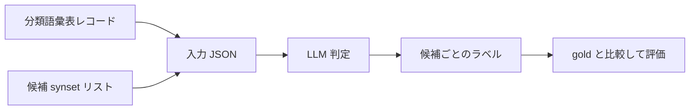
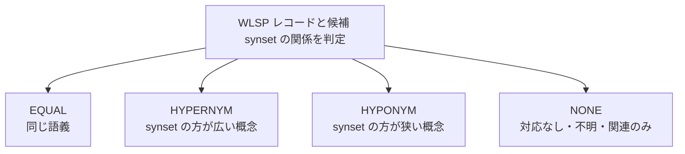
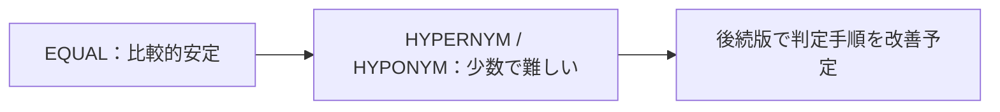

# LLM アラインメント

  
  
  
  

このディレクトリは、LLM を使ったアラインメント実験の説明をまとめる場所です。

アラインメントでは、分類語彙表レコードと候補 synset の対応関係を、LLM に `EQUAL / HYPERNYM / HYPONYM / NONE` の 4 値で判定させます。候補 synset はステージ 1（term expansion → BabelNet 検索）ですでに取得済みであり、LLM は候補を新たに探しません。

---

## 全体像

---

## 入力と出力

| 段階 | 内容 |
|---|---|
| 入力 | 1 つの分類語彙表レコードと、その候補 synset 一覧 |
| 候補情報 | 日本語・英語 lemma、日英 gloss、英語カテゴリ、上位語 lemma |
| チャンク | 1 回の API 入力は最大 50 候補 |
| 出力 | 候補 synset ごとの `label` と短い `reasoning` |

<small>lemma = 見出し語　gloss = 説明文</small>

入力 JSON は [src/alignment/alignment_inputs.py](../../src/alignment/alignment_inputs.py) で作成します。  
アラインメントは [src/alignment/run_alignment.py](../../src/alignment/run_alignment.py) で行い、[src/alignment/evaluate_alignment.py](../../src/alignment/evaluate_alignment.py) で評価します。

---

## ラベル

| ラベル | 判定の意味 |
|---|---|
| `EQUAL` | 分類語彙表レコードと synset が同じ語義を表す |
| `HYPERNYM` | synset がより一般的な概念である（上位語） |
| `HYPONYM` | synset がより具体的な概念である（下位語） |
| `NONE` | 同義でも上下位関係でもない、または判断できない |

主に見る指標は、`EQUAL` とそれ以外を分ける **pairwise F1** です。  
最終的に「同じ語義として対応付けるべき synset」をどれだけ正しく選べたかを見るためです。

---

## 評価結果

`record exact match` は、1 つの分類語彙表レコード内の全候補 synset について、予測した `(synset_id, label)` の集合が gold と完全に一致した割合です。ベースラインの record exact match と異なり、`EQUAL` だけでなく `HYPERNYM / HYPONYM / NONE` も含めて一致を見ています。

| 評価データ | モデル | n_records | n_pairs | Precision | Recall | F1 | record exact match |
|---|---|---:|---:|---:|---:|---:|---:|
| Gold B | `gpt-5.2-2025-12-11` | 177 | 2,654 | 0.8706 | 0.8000 | **0.8338** | 0.6045 |
| Gold B | `gpt-5.4-2026-03-05` | 177 | 2,654 | 0.8896 | 0.7838 | 0.8333 | 0.6215 |
| Gold A | `gpt-5.2-2025-12-11` | 86 | 1,003 | 0.8571 | 0.7714 | **0.8120** | 0.6279 |
| Gold A | `gpt-5.4-2026-03-05` | 86 | 1,003 | 0.7971 | 0.7857 | 0.7914 | 0.6279 |

<small>prompt = v1、schema = v1、推論量 = high</small>

`EQUAL` は比較的安定して判定できています。一方、`HYPERNYM` と `HYPONYM` は正例数が少なく語義の粒度差も細かいため、`EQUAL` より不安定です。

---

## プロンプト・スキーマ

| ドキュメント | 内容 |
|---|---|
| [prompts/v1.md](prompts/v1.md) | prompt v1 の設計意図と判定ルール |
| [prompts/v2.md](prompts/v2.md) | prompt v2 の設計意図と v1 からの変更点 |
| [schemas/v1.md](schemas/v1.md) | schema v1 の形式と validation |
| [src/alignment/prompt_registry.md](../../src/alignment/prompt_registry.md) | prompt・schema のバージョン管理メモ |

---

## 主要ファイル

| ファイル | 役割 |
|---|---|
| [src/alignment/alignment_inputs.py](../../src/alignment/alignment_inputs.py) | API に渡す入力 JSON を生成 |
| [src/alignment/run_alignment.py](../../src/alignment/run_alignment.py) | prompt・schema を読み、Responses API を実行 |
| [src/alignment/evaluate_alignment.py](../../src/alignment/evaluate_alignment.py) | 予測 JSON を gold と比較して評価 |
| [src/alignment/prompts/](../../src/alignment/prompts/) | prompt バージョンを管理 |
| [src/alignment/schemas/](../../src/alignment/schemas/) | schema バージョンを管理 |

---

## 備考

公開版リポジトリには API の生レスポンスや候補内容を含む中間生成物は含めていません。  
必要な場合は、各自の環境でデータと API キーを設定して再生成する前提です。
