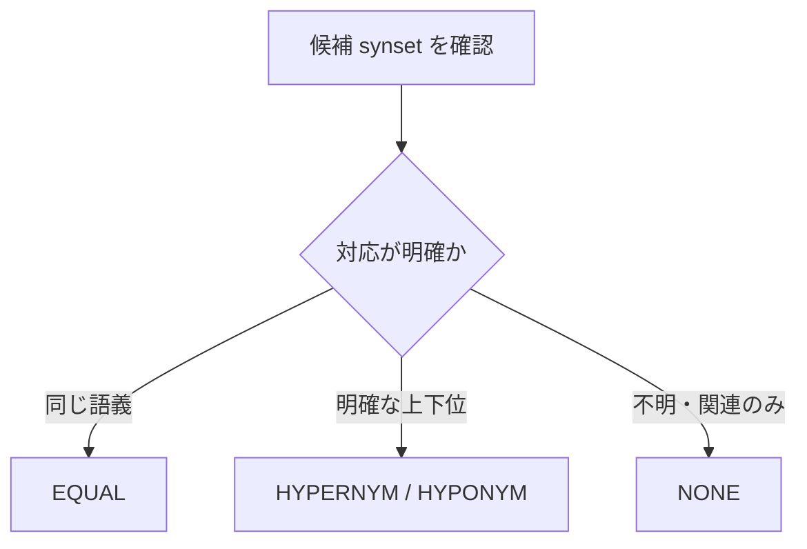

# Prompt v1

`prompt v1` は、アラインメント実験で最初に使った詳細版のプロンプトです。  
分類語彙表レコードと候補 synset を見比べ、候補ごとに `EQUAL / HYPERNYM / HYPONYM / NONE` を付けるための判定基準を LLM に与えます。

---

## ファイル

| 項目 | 内容 |
|---|---|
| prompt | [src/alignment/prompts/alignment_prompt_v1.txt](../../../src/alignment/prompts/alignment_prompt_v1.txt) |
| schema | [src/alignment/schemas/alignment_schema_v1.json](../../../src/alignment/schemas/alignment_schema_v1.json) |
| 実行結果の命名規則 | `{model}_high_v1_v1` |

---

## 設計の狙い

v1 の中心は、**誤った対応付けをなるべく避けること**です。  
対応関係が明確でない場合は `NONE` を選ぶよう強く指示しています。

---

## 主なルール

| 観点 | v1 の指示 |
|---|---|
| 基本方針 | 迷う場合は `NONE` |
| `EQUAL` | WLSP の見出し語が、その synset の自然な日本語名になる場合だけ |
| 上下位関係 | taxonomic な is-a 関係に限定 |
| gloss | 日本語 gloss と英語 gloss の両方を見る |
| 壊れた gloss | 日本語 gloss が明らかに壊れている場合は、英語 gloss や lemma を優先 |
| 除外 | 部分関係・属性・材料・症状・状態・単なる関連は `NONE` |

<small>lemma = 見出し語　gloss = 説明文</small>

---

## 特徴

- 判定ルールがかなり細かい
- few-shot 例を含む
- `EQUAL` を厳しめに判定する
- `HYPERNYM / HYPONYM` は分類上の is-a 関係に限定する
- 出力は schema に従った JSON のみに制限する

---

## 評価上の位置づけ

公開版 outputs に残しているアラインメント評価結果は、主に `prompt v1 + schema v1` の実行結果です。  
`EQUAL` の判定は比較的安定しましたが、`HYPERNYM / HYPONYM` は正例数が少なく粒度差も細かいため、難しい結果になりました。

---

## 評価結果

`record exact match` は、1 つの分類語彙表レコード内の全候補 synset について、予測した `(synset_id, label)` の集合が gold と完全に一致した割合です。

| 評価データ | モデル | n_records | n_pairs | Precision | Recall | F1 | record exact match |
|---|---|---:|---:|---:|---:|---:|---:|
| Gold B | `gpt-5.2-2025-12-11` | 177 | 2,654 | 0.8706 | 0.8000 | **0.8338** | 0.6045 |
| Gold B | `gpt-5.4-2026-03-05` | 177 | 2,654 | 0.8896 | 0.7838 | 0.8333 | 0.6215 |
| Gold A | `gpt-5.2-2025-12-11` | 86 | 1,003 | 0.8571 | 0.7714 | **0.8120** | 0.6279 |
| Gold A | `gpt-5.4-2026-03-05` | 86 | 1,003 | 0.7971 | 0.7857 | 0.7914 | 0.6279 |
