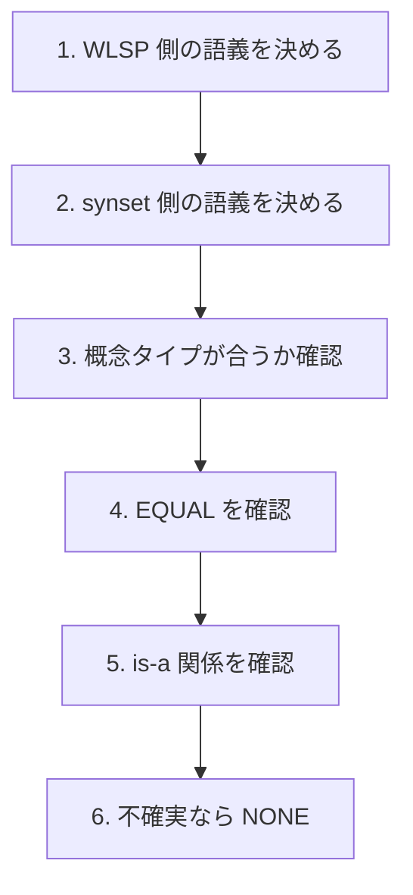

# Prompt v2

`prompt v2` は、`prompt v1` を短く整理した版です。  
v1 の保守的な方針（迷ったら `NONE`）を維持しながら、判定手順を step 形式で整理し、プロンプトの管理をしやすくすることを目的としています。

---

## ファイル

| 項目 | 内容 |
|---|---|
| prompt | [src/alignment/prompts/alignment_prompt_v2.txt](../../../src/alignment/prompts/alignment_prompt_v2.txt) |
| schema | [src/alignment/schemas/alignment_schema_v1.json](../../../src/alignment/schemas/alignment_schema_v1.json) |
| 位置づけ | prompt v1 の手続き型プロンプト版 |

---

## v1 からの変更点

| 観点 | v1 | v2 |
|---|---|---|
| 長さ | 長い | 短い |
| few-shot 例 | あり | なし |
| 判定手順 | 注意事項を多く列挙 | step 形式で整理 |
| 基本方針 | `NONE` を優先 | `NONE` を優先（変更なし） |
| 保守性 | 低め | 高め |

v2 では few-shot 例を削り、判断順序を明確にしています。

---

## 判定手順

1. `headword_ja`・`synonyms_ja`・`category_path_ja` から WLSP 側の語義を決める
2. `gloss_en` と `gloss_ja` を主な根拠として synset 側の語義を決める
3. disease vs symptom・entity vs property・whole vs part などの概念タイプ不一致を除外する
4. 粒度が一致し、自然な日本語名になる場合だけ `EQUAL`
5. 明確な taxonomic is-a 関係だけ `HYPERNYM / HYPONYM`
6. 迷う場合は `NONE`

---

## 位置づけ

v2 は、v1 の長さと複雑さを減らすためのプロンプトです。  
schema の構造は変えず、プロンプトの書き方による判定の変化を比較しやすくしています。

---

## 評価結果

v2 はまだ実行していません（実施予定）。  
実行後はこのセクションに結果を追記します。
