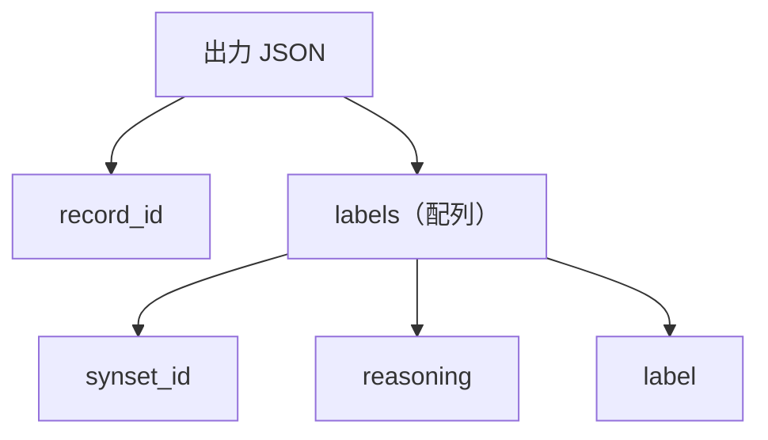

# Schema v1

`schema v1` は、アラインメント実験で LLM の出力形式を固定するための JSON Schema です。  
プロンプトが判定基準を与えるのに対して、schema は返ってくる JSON の構造を制御します。

---

## ファイル

| 項目 | 内容 |
|---|---|
| schema | [src/alignment/schemas/alignment_schema_v1.json](../../../src/alignment/schemas/alignment_schema_v1.json) |
| 対応 prompt | [src/alignment/prompts/alignment_prompt_v1.txt](../../../src/alignment/prompts/alignment_prompt_v1.txt) |
| 出力形式 | `record_id` と `labels` |

---

## 構造



| フィールド | 型 | 内容 |
|---|---|---|
| `record_id` | string | 分類語彙表レコード ID |
| `labels` | array | 候補 synset ごとの判定結果 |
| `labels[].synset_id` | string | BabelNet synset ID |
| `labels[].reasoning` | string | 短い判断根拠 |
| `labels[].label` | string enum | `EQUAL / HYPERNYM / HYPONYM / NONE` のいずれか |

---

## 出力例

```json
{
  "record_id": "57550",
  "labels": [
    {
      "synset_id": "bn:...",
      "reasoning": "brief justification",
      "label": "EQUAL"
    }
  ]
}
```

---

## バリデーション

schema v1 は余分なフィールドを許可しない設定です。さらに [src/alignment/run_alignment.py](../../../src/alignment/run_alignment.py) 側で、入力と出力の対応を確認しています。

| 確認内容 | 場所 |
|---|---|
| JSON の形が正しい | schema |
| `label` が許可ラベルだけ | schema |
| `record_id` が入力と一致する | [src/alignment/run_alignment.py](../../../src/alignment/run_alignment.py) |
| 入力候補と出力候補の数が一致する | [src/alignment/run_alignment.py](../../../src/alignment/run_alignment.py) |
| `synset_id` の集合が一致する | [src/alignment/run_alignment.py](../../../src/alignment/run_alignment.py) |

評価では `labels[].label` を gold ラベルと比較します。  
`reasoning` は評価指標には使わず、予測を確認するための補助情報として残しています。
