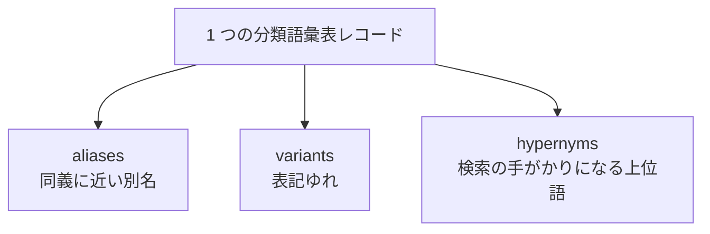

# 候補語拡張（Term Expansion）

<p align="left">
  
  
  
  
</p>

このディレクトリは、BabelNet 候補取得のための **候補語拡張（term expansion）** を説明する場所です。

分類語彙表の見出し語や JMdict の英訳だけでは BabelNet 候補を拾いきれない場合に備えて、LLM を使ってレコードの言い換え語を生成します。

---

## 位置づけ


全体の実験では、候補語拡張は最初の **ステージ 1（候補取得）** に属します。  
候補を増やしたあとで、ベースラインや LLM アラインメントがそれらの候補を評価します。

候補は平均して **11 語**増加しました。また、拡張語経由で取得された候補のうち約 **45%** が対応関係あり（`EQUAL` または上下位）となりました（詳細は[卒業論文](https://drive.google.com/file/d/1ReCxskEOtIV67eivSDymeZBjhWBMT48v/view?usp=sharing/)参照）。

---

## 生成する語の種類



| 出力フィールド | 内容 |
|---|---|
| `aliases_ja` / `aliases_en` | 元の語と同じ概念を指しやすい別名 |
| `variants_ja` / `variants_en` | 表記ゆれ・別表記・辞書で使われそうな形 |
| `hypernyms_ja` / `hypernyms_en` | 候補検索を広げるための上位語 |

各フィールドは 0〜3 語です。元の `lemma_ja` や `jmdict_en` をそのまま返さないようにし、BabelNet で検索語として使いやすい辞書見出し語に寄せています。

---

## 主要ファイル

| 段階 | 主な内容 | スクリプト |
|---|---|---|
| 入力 JSON 作成 | 分類語彙表レコード・見出し語・かな・JMdict 英訳・同じ細分類の語 | [src/term_expansion/term_expansion_inputs.py](../../src/term_expansion/term_expansion_inputs.py) |
| LLM 実行 | OpenAI Responses API で検索語を生成 | [src/term_expansion/run_term_expansion.py](../../src/term_expansion/run_term_expansion.py) |
| parsed 出力 | レコードごとの構造化 JSON | [outputs/api_runs/term_expansion/version_1/gold_A/parsed/](../../outputs/api_runs/term_expansion/version_1/gold_A/parsed/) / [gold_B/parsed/](../../outputs/api_runs/term_expansion/version_1/gold_B/parsed/) |

LLM の出力は、上の 6 種類の検索語リストを持つ JSON として保存されます。

---

## 公開データ

公開版では、LLM の生レスポンスではなく、整形済みの `parsed` のみを置いています。

- [Gold A parsed outputs](../../outputs/api_runs/term_expansion/version_1/gold_A/parsed/)
- [Gold B parsed outputs](../../outputs/api_runs/term_expansion/version_1/gold_B/parsed/)
- 公開方針: [outputs/README.md](../../outputs/README.md)

`parsed` には分類語彙表に基づく情報を含むため、公開利用は WLSP の CC BY-NC-SA 3.0 の範囲を前提にしています。BabelNet データ本体や API 生レスポンスは、この公開版には含めていません。

---

## 再実行

実験全体の再現コマンドは [README.md](../../README.md) の「実行方法」にまとめています。  
候補語拡張だけを再実行する場合は、次の 2 段階です。

```powershell
$env:PYTHONPATH = "src"

python src/term_expansion/term_expansion_inputs.py `
  --wlsp data/processed/wlsp.pkl `
  --records data/gold/gold_A_records.pkl `
  --out-dir data/interim/api_inputs/term_expansion/version_1/gold_A

python src/term_expansion/run_term_expansion.py `
  --model gpt-5.2 `
  --input-dir data/interim/api_inputs/term_expansion/version_1/gold_A `
  --out-dir outputs/api_runs/term_expansion/version_1/gold_A `
  --key_path .vscode/openai-key.json
```

Gold B で実行する場合は、`--records` と入出力ディレクトリを `gold_B` 側に変えます。

---

## 関連ドキュメント

- 候補取得から評価までの全体像: [README.md](../../README.md)
- ベースライン実験: [docs/baselines/README.md](../baselines/README.md)
- LLM アラインメント実験: [docs/alignment/README.md](../alignment/README.md)
- データの扱い: [data/README.md](../../data/README.md)
